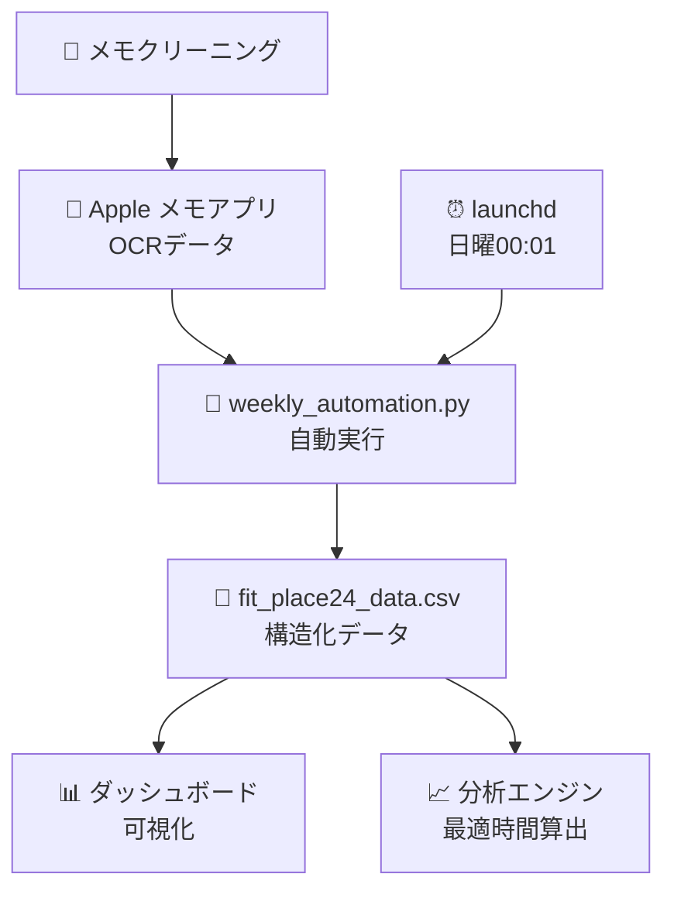

# 🏋️ FIT PLACE24 混雑状況分析システム

フィットネス施設「FIT PLACE24」の混雑状況を自動で収集・分析し、最適な利用時間を可視化するシステムです。

## ✨ 特徴

- **📱 自動データ収集**: Apple メモアプリから OCR データを自動取得
- **📊 インタラクティブダッシュボード**: 曜日別・時間別の混雑状況を可視化
- **🤖 完全自動化**: 週次実行で継続的なデータ収集
- **📈 トレンド分析**: 最適利用時間帯の特定と混雑予測

## 🚀 システム構成

### **ダッシュボード (3 つの実装)**

1. **📊 メインダッシュボード** - `index.html`

   - ES6 モジュール対応の高機能版
   - リアルタイムデータ更新・エクスポート機能付き

2. **⚛️ React 版ダッシュボード** - `crowd-dashboard-modern/`

   - TypeScript + React + Tailwind CSS
   - 最新のモダン UI 実装

3. **📂 レガシー版** - `legacy/`
   - 互換性重視のシンプル版

### **🔄 自動化システム**

- **`weekly_automation.py`** - メイン自動化エンジン
- **`setup_weekly_automation.sh`** - 自動実行セットアップ
- **`com.user.gym.analysis.weekly.plist`** - macOS launchd 設定

## 📋 プロジェクト構造

```
training_waitnum_analysis/
├── 📊 ダッシュボード
│   ├── index.html                     # メインダッシュボード
│   ├── style.css                      # 共通スタイル
│   ├── js/                           # モジュール化JavaScript
│   │   ├── dashboard.js              # メインコントローラー
│   │   ├── config.js                 # 設定管理
│   │   ├── dataLoader.js            # データ読み込み
│   │   ├── dataProcessor.js         # データ処理
│   │   └── chartManager.js          # チャート管理
│   ├── css/enhanced.css              # 拡張スタイル
│   └── crowd-dashboard-modern/       # React版
│
├── 🤖 自動化システム
│   ├── weekly_automation.py          # メイン自動化スクリプト
│   ├── setup_weekly_automation.sh    # セットアップツール
│   └── com.user.gym.analysis.weekly.plist # 週次実行設定
│
├── 📁 データ・バックアップ
│   ├── fit_place24_data.csv          # メインデータファイル
│   ├── automation.log               # 実行ログ
│   └── backups/                     # 自動バックアップ
│
├── 📂 レガシー
│   └── legacy/                      # 旧版ファイル
│
└── 📄 ドキュメント
    └── README.md                    # このファイル
```

## 🔧 セットアップ

### **1. 自動化システムの設定**

```bash
# セットアップスクリプトを実行
./setup_weekly_automation.sh

# 自動実行サービスをインストール
# 毎週日曜日 00:01 に自動実行されます
```

### **2. ダッシュボードの起動**

```bash
# ローカルサーバーで起動（推奨）
python3 -m http.server 8000

# ブラウザでアクセス
open http://localhost:8000
```

### **3. React 版の起動**

```bash
cd crowd-dashboard-modern
npm install
npm run dev
```

## 📊 データフロー



## 🎯 主要機能

### **📊 ダッシュボード機能**

- 曜日別・時間別混雑状況チャート
- 平均人数・最適時間帯の表示
- CSV/JSON エクスポート
- リアルタイムデータ更新
- レスポンシブ対応

### **🤖 自動化機能**

- 週次データ収集（日曜 00:01 実行）
- 古いメモデータの自動クリーニング
- 重複データの自動除去
- エラーハンドリング・ログ管理
- バックアップ自動作成

### **📈 分析機能**

- 時間帯別混雑パターン分析
- 最適利用時間帯の特定
- 混雑予測とアラート
- トレンド可視化

## 💡 使用技術

- **Frontend**: HTML5, CSS3, JavaScript (ES6+), Chart.js
- **React 版**: TypeScript, React, Tailwind CSS, Vite
- **Backend**: Python 3.x, AppleScript
- **自動化**: macOS launchd, shell scripts
- **データ**: CSV, JSON

## 📱 動作環境

- **OS**: macOS (Apple メモアプリ必須)
- **ブラウザ**: Chrome, Safari, Firefox (ES6 対応)
- **Python**: 3.7 以上
- **Node.js**: 16 以上 (React 版のみ)

## 🔗 関連リンク

- **GitHub**: https://github.com/iori73/training_waitnum.git
- **技術詳細**: `/crowd-dashboard-modern/README.md`
- **レガシー版**: `/legacy/README_legacy.md`

## 📄 ライセンス

MIT License

---

**最終更新**: 2025 年 7 月 23 日  
**バージョン**: v2.0  
**作成者**: Dashboard Team
