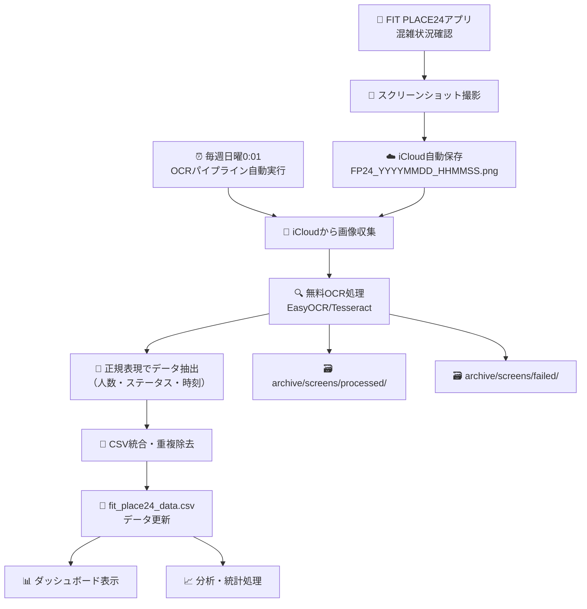

# 🏋️ FIT PLACE24 混雑状況分析システム

フィットネス施設「FIT PLACE24」の混雑状況を自動で収集・分析し、最適な利用時間を可視化するシステムです。

## ✨ 特徴

- **📱 自動データ収集**: iPhone スクリーンショットから無料OCRで自動データ抽出
- **📊 インタラクティブダッシュボード**: 曜日別・時間別の混雑状況を可視化
- **🤖 完全自動化**: 週次実行で継続的なデータ収集
- **📈 トレンド分析**: 最適利用時間帯の特定と混雑予測

## 🚀 システム構成

### **ダッシュボード (3 つの実装)**

1. **📊 メインダッシュボード** - `index.html`

   - ES6 モジュール対応の高機能版
   - リアルタイムデータ更新・エクスポート機能付き

2. **⚛️ React 版ダッシュボード** - `crowd-dashboard-modern/`

   - TypeScript + React + Tailwind CSS
   - 最新のモダン UI 実装

3. **📂 レガシー版** - `legacy/`
   - 互換性重視のシンプル版

### **🔄 自動化システム (2 つの実装)**

#### **1. 画像OCRパイプライン版（推奨・無料）**

- **`weekly_ocr_pipeline.py`** - 画像→無料OCR→CSV統合エンジン
- **`weekly_automation.py`** - [非推奨] 旧ファイルベース版
- **`setup_weekly_automation.sh`** - 自動実行セットアップ
- **`com.user.gym.analysis.weekly.plist`** - macOS launchd 設定

#### **2. Agent モード版（開発・リアルタイム）**

- **`agent_automation.py`** - Cursor Agent 対応版
- **リアルタイム監視** - 継続的なデータ監視
- **Cursor 連携** - 通知・デバッグ機能付き

## 📋 プロジェクト構造

```
training_waitnum_analysis/
├── 📊 src/ - ソースコード
│   ├── automation/                   # 自動化システム
│   │   ├── weekly_ocr_pipeline.py   # 画像OCRメインパイプライン
│   │   └── weekly_automation.py     # [非推奨] 旧ファイルベース版
│   └── dashboard/                   # ダッシュボード
│       ├── index_v2.html           # メインダッシュボード
│       ├── style.css               # 共通スタイル
│       ├── js/                     # JavaScript モジュール
│       │   ├── dashboard.js        # メインコントローラー
│       │   ├── config.js           # 設定管理
│       │   ├── dataLoader.js       # データ読み込み
│       │   ├── dataProcessor.js    # データ処理
│       │   └── chartManager.js     # チャート管理
│       ├── css/enhanced.css        # 拡張スタイル
│       └── assets/                 # アセット（ロゴ等）
│
├── 🔧 config/ - 設定ファイル
│   ├── com.user.gym.analysis.weekly.plist # macOS launchd設定
│   └── setup_weekly_automation.sh   # セットアップスクリプト
│
├── 📁 data/ - データファイル
│   └── fit_place24_data.csv         # メインデータファイル
│
├── 📋 logs/ - ログファイル
│   └── (自動生成されるログ)
│
├── 💾 backups/ - 自動バックアップ
│   └── memo_backup_*.txt            # メモバックアップ
│
├── 🗃️ archive/ - アーカイブ・処理済みファイル
│   ├── screens/                     # 処理済み画像アーカイブ
│   │   ├── processed/               # 正常処理済み画像
│   │   └── failed/                  # 処理失敗画像
│   └── (その他アーカイブファイル)
│
├── ⚛️ crowd-dashboard-modern/ - React版ダッシュボード
│   └── (TypeScript + React + Tailwind CSS実装)
│
├── 📂 legacy/ - レガシー実装
│   └── (旧版ファイル)
│
├── 🗃️ archive/ - アーカイブ
│   ├── diagnostic_scripts/          # 診断・テストスクリプト
│   ├── test_reports/               # テストレポート
│   ├── alternative_implementations/ # 代替実装（Agent等）
│   └── temp_files/                 # 一時ファイル・バックアップ
│
└── 📄 README.md                     # このファイル
```

## 🔧 セットアップ

### **画像OCRパイプラインセットアップ**

#### **🔹 ステップ 1: OCRライブラリインストール**

```bash
# 無料OCRライブラリインストール
pip install -r requirements_ocr.txt

# macOS用Tesseractインストール
brew install tesseract tesseract-lang
```

#### **🔹 ステップ 2: 自動実行セットアップ**

```bash
# セットアップスクリプトを実行
./config/setup_weekly_automation.sh

# 自動実行サービスをインストール
# 毎週日曜日 00:01 に画像OCRパイプラインが自動実行
```

#### **🔹 ステップ 3: iPhone側設定**

iCloudに画像を保存する設定：
- 保存先：`iCloud Drive/Shortcuts/FIT_PLACE24/`
- ファイル名形式：`FP24_20250815_222321.png` または `2025:08:15, 22:23.png`

#### **🔹 レガシー版（Agent モード）**

開発・デバッグ用の旧システム：

```bash
# 依存関係インストール
pip install -r archive/alternative_implementations/requirements_agent.txt

# Agentモード起動
python3 archive/alternative_implementations/agent_automation.py
```

### **ダッシュボードの起動**

```bash
# ローカルサーバーで起動（推奨）
python3 -m http.server 8000

# ブラウザでアクセス
open http://localhost:8000/src/dashboard/index_v2.html
```

### **React 版の起動**

```bash
cd crowd-dashboard-modern
npm install
npm run dev
```

## 🆚 自動化システム比較

| 機能                 | launchd 版     | Agent モード版  |
| -------------------- | -------------- | --------------- |
| **実行方式**         | システムレベル | Cursor 内蔵     |
| **信頼性**           | ⭐⭐⭐⭐⭐     | ⭐⭐⭐⭐        |
| **設定の複雑さ**     | 中程度         | シンプル        |
| **リアルタイム監視** | ❌             | ✅              |
| **Cursor 連携**      | ❌             | ✅              |
| **リソース使用量**   | 最小           | 中程度          |
| **デバッグ**         | ログファイル   | リアルタイム    |
| **動的設定変更**     | ❌             | ✅              |
| **増分データ処理**   | ❌             | ✅              |

### **🎯 選択指針**

#### **launchd 版を選ぶべき場合**

- ✅ 本番環境での安定運用
- ✅ Cursor を常時起動しない
- ✅ システムリソース使用量を最小化したい
- ✅ シンプルな週次実行のみで十分

#### **Agent モード版を選ぶべき場合**

- ✅ 開発・テスト環境
- ✅ Cursor を常時使用する
- ✅ リアルタイム監視が必要
- ✅ 柔軟な設定変更が必要
- ✅ 新データの即座処理が必要

## ✨ 新システムフロー（画像OCR方式・３ステップ）

### **ステップ1️⃣: アプリ確認とスクリーンショット**
📱 **FIT PLACE24アプリ + iPhoneスクリーンショット**
- **何をする**: アプリで混雑状況を確認し、スクリーンショットを撮影
- **iPhone側の作業**: 
  1. FIT PLACE24アプリで混雑状況確認
  2. スクリーンショットを撮影
  3. iCloudに自動保存: `FP24_20250815_222321.png`
- **表示情報**: 人数・ステータス・時刻を画像として保存

### **ステップ2️⃣: 週次自動OCR処理**
🗓️ **毎週日曜日 00:01 自動実行**
- **処理内容**:
  1. **画像収集**: iCloudから新しいPNGファイルを取得
  2. **無料OCR**: EasyOCR/Tesseractでテキスト抽出
  3. **データ解析**: 既存の優秀な正規表現で人数・ステータス抽出
  4. **CSV統合**: 重複除去・フォーマット変換
  5. **アーカイブ**: 処理済み画像を`archive/screens/`に移動
- **コスト**: 完全無料（オープンソースOCRライブラリ使用）

### **ステップ3️⃣: ダッシュボード表示と分析**
📊 **データ分析と表示**
- 分析処理:
  - 曜日別の平均混雑度
  - 時間帯別の傾向分析
  - 最適利用時間の算出
- ダッシュボード表示:
  - 📈 リアルタイム混雑グラフ
  - 📅 曜日・時間別チャート
  - 🎯 おすすめ利用時間
  - 📋 最新データ一覧

## 📊 新システムフロー図（画像OCR方式）



## 🎯 主要機能

### **📊 ダッシュボード機能**

- 曜日別・時間別混雑状況チャート
- 平均人数・最適時間帯の表示
- CSV/JSON エクスポート
- リアルタイムデータ更新
- レスポンシブ対応

### **🤖 自動化機能**

- 週次データ収集（日曜 00:01 実行）
- 古いメモデータの自動クリーニング
- 重複データの自動除去
- エラーハンドリング・ログ管理
- バックアップ自動作成

### **📈 分析機能**

- 時間帯別混雑パターン分析
- 最適利用時間帯の特定
- 混雑予測とアラート
- トレンド可視化

### **🔍 Agent モード限定機能**

- リアルタイムデータ監視
- 増分データ処理
- Cursor 通知連携
- 動的設定変更
- デバッグモード

## 💡 使用技術

- **Frontend**: HTML5, CSS3, JavaScript (ES6+), Chart.js
- **React 版**: TypeScript, React, Tailwind CSS, Vite
- **Backend**: Python 3.x, AppleScript
- **自動化**: macOS launchd, Cursor Agent, Python schedule
- **データ**: CSV, JSON

## 📱 動作環境

- **OS**: macOS (Apple メモアプリ必須)
- **ブラウザ**: Chrome, Safari, Firefox (ES6 対応)
- **Python**: 3.7 以上
- **Node.js**: 16 以上 (React 版のみ)
- **Cursor**: 最新版 (Agent モードのみ)

## 🔗 関連リンク

- **GitHub**: https://github.com/iori73/training_waitnum.git
- **技術詳細**: `/crowd-dashboard-modern/README.md`
- **Agent モード**: `/README_agent.md`
- **レガシー版**: `/legacy/README_legacy.md`

## 📄 ライセンス

MIT License

---

**最終更新**: 2025年08月31日  
**バージョン**: v2.1  
**作成者**: Dashboard Team

---

## 📈 現在のシステム状況

### **📊 データ統計**
- **総データ数**: 198件の混雑記録（CSVヘッダー除く、199行）
- **データ期間**: 2025-06-29〜2025-08-31
- **最新更新**: 2025-08-31
- **データ範囲**: 朝4時〜夜23時台の混雑状況### **🎯 分析結果例**
- **データ収集方法**:  ショートカット + OCR → Apple Notes → 週次自動処理
- **自動処理頻度**: 毎週日曜日 0:01（macOS launchd）
- **バックアップ**: 自動メモバックアップ機能付き

### **🚀 実際の使用方法**

### **🎯 新しい使用方法（簡単・無料）**

#### **👤 あなたがすること**
1. 📱 **アプリ確認**: FIT PLACE24アプリで混雑状況を確認
2. 📸 **スクリーンショット**: アプリ画面をスクリーンショットしてiCloud保存
3. 📊 **結果確認**: ダッシュボードで分析結果を確認

#### **🤖 システムが自動で行うこと**
- **週次画像OCR**: 毎週日曜日にiCloudから画像を収集し無料OCR処理
- **データ抽出**: 既存の優秀な正規表現で人数・ステータスを自動抽出
- **CSV統合**: 重複除去・フォーマット統一してデータファイル更新
- **画像アーカイブ**: 処理済み画像を自動でarchiveフォルダに整理
- **統計分析**: 最適利用時間帯と混雑傾向を自動算出

**次回自動実行**: 次の日曜日 0:01に新しいデータを自動処理

---

このシステムは、公式アプリの画像データと無料OCR技術、macOS定期実行を組み合わせた、完全無料で効率的なジム利用サポートシステムです。簡単なスクリーンショット撮影と自動化された画像解析により、あなたの日常的なアプリ利用を貴重なデータ資産に変換します。 🏋️‍♂️✨💰
