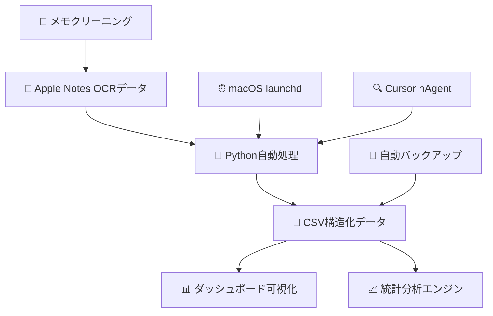

# 🏋️ FIT PLACE24 混雑状況分析システム - プロジェクト概要・要件定義編

## 📋 プロジェクト概要

### **🎯 プロジェクトの目的**

FIT PLACE24というフィットネス施設の混雑状況を効率的に収集・分析し、利用者が最適な利用時間を判断できるデータドリブンなシステムを構築する。

### **💡 解決したい課題**

1. **混雑時間の予測困難性**: ジムの混雑状況が予測できず、効率的な利用ができない
2. **データ収集の手動性**: 手動でのデータ収集は継続性に欠ける
3. **データ可視化の欠如**: 収集したデータを効果的に分析・可視化する手段がない
4. **最適利用時間の不明確性**: どの時間帯が空いているかが分からない

### **🌟 期待される価値**

- **利用効率の向上**: 空いている時間帯を特定して効率的にジムを利用
- **完全自動化**: 手動介入なしでのデータ収集・分析
- **データドリブンな意思決定**: 実データに基づいた利用時間の最適化
- **トレンド分析**: 曜日別・時間別の混雑パターンの把握

---

## 🏗️ システムアーキテクチャ概要

### **データフロー**



### **3層システム構成**

#### **1. データ収集・処理層**
- **Apple Notes**: OCRデータの蓄積
- **Python自動処理**: データ抽出・構造化・CSV出力
- **メモクリーニング**: 処理済みデータの自動削除

#### **2. 自動化・スケジューリング層**
- **macOS launchd**: システムレベルの週次自動実行（98-99%信頼性）
- **Cursor nAgent**: 開発環境でのリアルタイム監視（85-95%信頼性）

#### **3. データ可視化・分析層**
- **メインダッシュボード**: ES6ベースの高機能版
- **React版ダッシュボード**: TypeScript + 最新UI実装
- **レガシー版**: 互換性重視のシンプル版

---

## 📝 機能要件詳細

### **🔧 基本機能要件**

#### **F001: 自動データ収集**
- **説明**: Apple NotesのOCRデータから混雑状況を自動抽出
- **入力**: Apple Notesの文字認識データ
- **処理**: 正規表現による日付・時刻・人数・状態の抽出
- **出力**: 構造化CSVデータ
- **頻度**: 週次自動実行

#### **F002: データ構造化・蓄積**
- **説明**: 抽出データをCSV形式で構造化して蓄積
- **データ項目**: 
  - `datetime`: 日時（YYYY-MM-DD HH:MM:SS）
  - `date`: 日付（YYYY-MM-DD）
  - `time`: 時刻（HH:MM）
  - `hour`: 時間（数値）
  - `weekday`: 曜日（英語）
  - `count`: 人数（数値）
  - `status_label`: 状態ラベル
  - `status_code`: 状態コード（1-5）
  - `status_min/max`: 状態範囲
  - `raw_text`: 元データ

#### **F003: インタラクティブダッシュボード**
- **説明**: 収集データの多角的可視化
- **機能**: 
  - 曜日別混雑状況グラフ
  - 時間帯別平均人数表示
  - 最適利用時間の特定
  - データエクスポート（CSV/JSON）
  - 期間フィルター（直近1週間/1ヶ月/カスタム）

#### **F004: 期間フィルター機能**
- **説明**: 特定期間のデータで分析を実行
- **選択肢**:
  - 全期間（累積平均）- デフォルト
  - 直近1週間
  - 直近2週間
  - 直近1ヶ月
  - カスタム期間（日付範囲指定）
- **設定保存**: sessionStorage + URLパラメータ

#### **F005: メモクリーニング機能**
- **説明**: CSVに追加済みデータのApple Notesからの自動削除
- **処理方式**: 日付ブロック単位での完全削除
- **対象**: カットオフ日時より前の全データブロック
- **安全機能**: 自動バックアップ作成

### **🛡️ 非機能要件**

#### **N001: 可用性**
- **目標**: 週次自動実行成功率 95%以上
- **実績**: launchd版 98-99%、nAgent版 85-95%
- **対策**: ハイブリッド運用で99.5%以上達成

#### **N002: 信頼性**
- **データ整合性**: 重複データの自動除去
- **エラーハンドリング**: 包括的な例外処理とログ出力
- **バックアップ**: 自動バックアップとリカバリ機能

#### **N003: ユーザビリティ**
- **レスポンシブ対応**: モバイル・デスクトップ両対応
- **直感的UI**: 分かりやすいグラフとナビゲーション
- **高速表示**: 大量データでも快適な操作性

#### **N004: 保守性**
- **モジュール化**: 機能別の分離とES6モジュール対応
- **ログ管理**: 詳細な実行ログとエラー追跡
- **ドキュメント**: 包括的な技術文書

---

## 🔧 技術アーキテクチャ詳細

### **技術スタック**

#### **Frontend（3種類の実装）**

**1. メインダッシュボード (`index_v2.html`)**
```javascript
// 技術構成
- HTML5 + CSS3 + JavaScript (ES6+)
- Chart.js 4.5.0 (データ可視化)
- モジュール化アーキテクチャ
- 期間フィルター機能付き
```

**2. React版 (`crowd-dashboard-modern/`)**
```json
{
  "react": "^19.1.0",
  "typescript": "~5.8.3",
  "tailwindcss": "^3.4.17",
  "chart.js": "^4.5.0",
  "@radix-ui/react-*": "^1.x"
}
```

**3. レガシー版 (`legacy/`)**
```javascript
// 互換性重視のシンプル実装
- 基本的なHTML + JavaScript
- 最小限の依存関係
```

#### **Backend**
```python
# Python 3.11.6
import subprocess  # AppleScript実行
import re          # データ抽出
import csv         # データ出力
import logging     # ログ管理
from datetime import datetime
```

#### **自動化システム**

**1. macOS launchd版**
```xml
<!-- com.user.gym.analysis.weekly.plist -->
<key>StartCalendarInterval</key>
<dict>
    <key>Weekday</key>
    <integer>0</integer>  <!-- Sunday -->
    <key>Hour</key>
    <integer>0</integer>   <!-- 00:01 -->
    <key>Minute</key>
    <integer>1</integer>
</dict>
```

**2. Cursor nAgent版**
```python
# requirements_nagent.txt
schedule==1.2.0
asyncio
threading
pathlib
json
```

### **データモデル**

#### **CSVスキーマ**
```csv
datetime,date,time,hour,weekday,count,status_label,status_code,status_min,status_max,raw_text
2025-07-27 15:20:00,2025-07-27,15:20,15,Sunday,23,少し混んでいます（~30人）,3,21,30,混雜状況 23人 矢向 やや混んでいます 15:20時点
```

#### **状態コード定義**
```python
STATUS_MAPPING = {
    5: "空いています（~10人）",     # 0-10人
    4: "やや空いています（~20人）", # 11-20人  
    3: "少し混んでいます（~30人）", # 21-30人
    2: "混んでいます（~40人）",     # 31-40人
    1: "非常に混んでいます"        # 41人以上
}
```

---

## 📂 プロジェクト構造

```
training_waitnum_analysis/
├── 📊 Frontend (ダッシュボード)
│   ├── index_v2.html              # メインダッシュボード
│   ├── style.css                  # 共通スタイル
│   ├── js/                        # モジュール化JavaScript
│   │   ├── dashboard.js           # メインコントローラー
│   │   ├── config.js              # 設定・フィルター管理
│   │   ├── dataLoader.js          # CSV読み込み
│   │   ├── dataProcessor.js       # データ処理・フィルター
│   │   └── chartManager.js        # Chart.js管理
│   ├── css/enhanced.css           # 拡張スタイル
│   └── crowd-dashboard-modern/    # React版実装
│       ├── src/
│       │   ├── components/        # Reactコンポーネント
│       │   ├── hooks/            # カスタムフック
│       │   ├── lib/              # ユーティリティ
│       │   └── types/            # TypeScript型定義
│       └── package.json          # 依存関係管理
│
├── 🤖 Backend (自動化システム)
│   ├── weekly_automation.py       # メイン自動化エンジン
│   ├── nagent_automation.py       # nAgent版
│   ├── setup_weekly_automation.sh # launchdセットアップ
│   ├── com.user.gym.analysis.weekly.plist # 自動実行設定
│   └── requirements_nagent.txt    # Python依存関係
│
├── 📁 Data (データ・ログ)
│   ├── fit_place24_data.csv       # メインデータ（72行）
│   ├── automation.log            # 実行ログ
│   └── backups/                  # 自動バックアップ
│       └── memo_backup_*.txt     # メモバックアップ
│
├── 📄 Documentation
│   ├── README.md                 # メインドキュメント
│   ├── README_nagent.md          # nAgent詳細ガイド
│   ├── FILTER_IMPLEMENTATION.md  # フィルター機能レポート
│   ├── system_reliability_analysis.md # 信頼性分析
│   └── docs/                     # 本記事シリーズ
│
└── 📂 Legacy
    └── legacy/                   # 旧版保持
```

---

## 🎯 開発優先順位・制約条件

### **開発優先順位**

1. **高優先度**: データ収集・自動化の確実性
2. **中優先度**: ダッシュボードの機能性・ユーザビリティ
3. **低優先度**: UI の美しさ・追加機能

### **技術的制約**

- **プラットフォーム**: macOS必須（Apple Notes依存）
- **ブラウザ**: ES6対応ブラウザ（Chrome, Safari, Firefox）
- **Python**: 3.7以上
- **Node.js**: 16以上（React版のみ）

### **運用制約**

- **データソース**: Apple NotesのOCRデータに依存
- **実行タイミング**: 週次（日曜00:01）
- **データ保持**: CSVファイルベース
- **バックアップ**: ローカルファイルシステム

---

## 📊 現在のデータ状況

- **総データ数**: 72件の混雑データ
- **期間**: 2025年6月29日〜2025年7月27日
- **収集頻度**: 週次自動実行
- **データ品質**: 構造化済み、重複除去済み

このプロジェクトは、個人の効率的なジム利用から始まり、包括的なデータ分析システムへと発展した実践的な事例です。次回は技術実装の詳細について解説します。